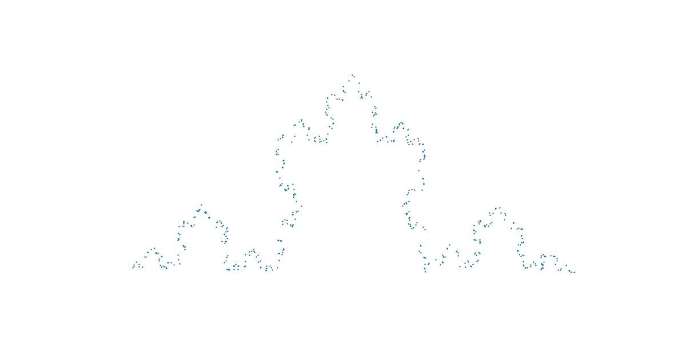

# IFS GAN

Proof of concept for using
an Iterated Function System and an Adversarial Loss
to learn a simple fractal from sample points.

Simon Schneider, May 2023

## Overview

This is a demonstration that it's possible to learn good approximations
to the parameters of simple fractals by sampling points near the fractal
and using Stochastic Gradient Descent and an Adversarial Loss.

This demonstration focuses on Koch's curve specifically,
but is designed for ease of experimentation and extension.

### To run this demo:

1. Prepare a python3 environment with numpy, matplotlib, and tensorflow.
2. Install the local `gan_utils` packages: `cd ..; python -m pip install .; cd IFS_GAN`.
3. Run the script: `python train_koch_make_video.py`.
The script will create a video of the training process
and write it to `images/koch_video.mp4`.

## Background

### Iterated Function Systems

[Iterated Function Systems](https://en.wikipedia.org/wiki/Iterated_function_system)
are a way of representing sets with regular hierarchy, such as some fractals.
An Iterated Function System (IFS) consists of a collection of affine transformations
that are contraction mappings, meaning that they bring points closer together
(Lipschitz-1 coefficient < 1).
For any IFS, there exists a unique set that is
the union of its images under the IFS's multiple transformations.
For example, notice that each side of the
[Koch Snowflake](https://en.wikipedia.org/wiki/Koch_snowflake)
is composed of 4 copies of itself (translated, rotated, and) at 1/3 scale.

We'll represent an IFS in code as a collection of Dense layers,
with a MaxNorm kernel constraint.
The number of dense layers and the max norm value are specified by the user.
To call an IFSLayer, the user gives two inputs:
the points to transform, represented as a tensor of floats;
and which transformations to apply in which order,
represented as a tensor of ints.
By starting with arbitrary input points
and repeatedly randomly sampling transformations to apply,
an approximation to the IFS's fixed-point set is generated.

### Generative Adversarial Networks

[Generative Adversarial Networks]()
(GANs) were invented in 2014.
The idea is that one neural network generates data
from a set of latent variables,
and another neural network discriminates between real data and
generated samples.
The original theoretical analysis treats the two networks as engaged in a
minimax game and proves that the game has nice convergence properties,
notwithstanding whether you can learn the Nash equilibrium via Stochastic Gradient Descent.

[Lots](https://arxiv.org/pdf/1606.03498.pdf) of
[subsequent](https://arxiv.org/pdf/1801.04406.pdf)
[work](https://arxiv.org/pdf/1902.03984.pdf)
has gone into trying to achieve good GAN convergence with SGD.
Most of the current line of thought involves either regularizing or constraining the 
discriminator,
so that it has smooth gradients that provide a useful training signal
in the limit that the generated sample distribution doesn't overlap with the 
target data distribution.
In this work I used a zero-centered L2 gradient norm penalty
evaluated on linear interpolations between data samples and generated samples,
and it seems to work well.

The typical way to evaluate GAN output is to use a pre-trained feature extractor
and compare the features of the generated samples to those of data.
In this case, since our samples are in a mere 2 dimensions,
a feature extractor is unnecessary.
And instead of comparing moments of sample distributions,
we'll compute the
[Hausdorff distance](https://en.wikipedia.org/wiki/Hausdorff_distance)
between a batch of real data and a batch of samples.
